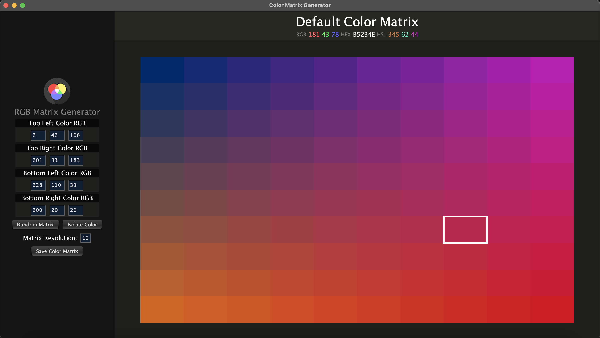

## Color Matrix Generator

Welcome to a real time adaptive color gradiant generator! This software provides the option to control any of the four corner colors by inputting RGB values. The software will then interpolate between the colors generating a color gradiant. The resolution of this matrix can also modified as well. 

The software also has the ability to download the current color matrix to your Desktop as well as isolate a given color onto a white and black background. On the main panel, the user can also select a given color to see its RGB, Hex, and HSL values. Linear interpolation formulations based off of https://harmoniccode.blogspot.com/2011/04/bilinear-color-interpolation.html

Created by Jack Blair
3/1/2021
MIT License
